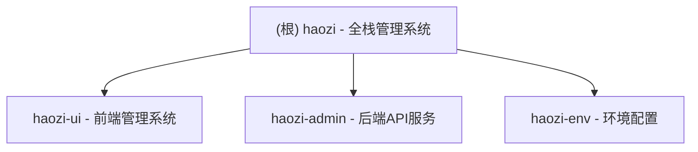

# CLAUDE.md

## 变更记录 (Changelog)

- **2025-11-26 15:00:58** - 初始化AI上下文，识别2个主要模块：haozi-ui (前端) 和 haozi-admin (后端)

## 项目愿景

haozi 是一个现代化的企业级全栈管理系统，采用前后端分离架构：
- **前端**：基于 Next.js 16 + React 19 + Ant Design 5 + TypeScript 5 的现代化管理界面
- **后端**：基于 Spring Boot 3 + Java 17 的企业级 API 服务

## ✨ 模块结构图



## 架构总览

### 技术架构
- **前端架构**：Next.js App Router + Ant Design + Tailwind CSS + TypeScript
- **后端架构**：Spring Boot 3 + MyBatis Plus + Sa-Token + Redis + MySQL
- **部署架构**：前端静态部署 + 后端JAR部署
- **云服务**：阿里云 OSS (文件存储) + RDS (数据库) + 短信服务

### 系统特性
- 🔐 基于 Sa-Token 的权限认证系统
- 📊 完整的 RBAC 权限管理
- 🌐 前后端分离架构
- 📱 响应式设计，支持移动端
- 🚀 高性能缓存策略 (Redis + Redisson)
- 📝 完整的操作日志记录
- 📁 文件上传下载管理

## 模块索引

| 模块名 | 类型 | 语言 | 职责 | 状态 |
|--------|------|------|------|------|
| **haozi-ui** | 前端 | TypeScript/Next.js | 管理系统前端界面 | ✅ 已识别 |
| **haozi-admin** | 后端 | Java/Spring Boot | API服务与业务逻辑 | ✅ 已识别 |

## 运行与开发

### 开发环境要求
- **Node.js**: 20+
- **Java**: 17+
- **MySQL**: 8.0+
- **Redis**: 6.0+

### 快速启动

#### 后端启动
```bash
cd haozi-admin
mvn clean compile
mvn spring-boot:run
# 访问: http://localhost:8080
```

#### 前端启动
```bash
cd haozi-ui
npm install
npm run dev
# 访问: http://localhost:3000
```

### 生产构建
```bash
# 后端打包
cd haozi-admin
mvn clean package -DskipTests

# 前端构建
cd haozi-ui
npm run build
npm start
```

## 测试策略

### 后端测试
- 使用 Spring Boot Test 进行单元测试
- 测试位置：`src/test/java/`
- 运行命令：`mvn test`

### 前端测试
- 测试配置待完善
- 建议使用 Jest + React Testing Library

## 编码规范

### 后端规范
- 遵循阿里巴巴 Java 开发规范
- 使用 Lombok 简化代码
- 统一使用 BaseEntity 作为基类
- 服务层接口与实现分离
- 使用 MapStruct 进行对象转换

### 前端规范
- 使用 TypeScript 严格模式
- 遵循 React Hooks 最佳实践
- 组件采用函数式组件
- 使用 Tailwind CSS 进行样式开发
- API 调用统一使用 services 层

## AI 使用指引

### 代码生成建议
1. **后端新增实体**：继承 BaseEntity，使用 MyBatis Plus 注解
2. **新增Controller**：使用 @RestController，统一返回 Result 包装
3. **前端页面**：使用 Ant Design 组件，遵循 App Router 结构
4. **API集成**：在 services 目录下创建对应的API服务文件

### 常用开发模式
- **CRUD操作**：后端使用 BaseService 模式，前端使用 services + hooks 模式
- **权限控制**：后端使用 Sa-Token 注解，前端使用路由守卫
- **文件上传**：统一使用阿里云OSS，后端提供上传接口

## 历史项目说明

### 原项目架构 (haozi-ui-antd)
历史上该项目包含一个名为 `haozi-ui-antd` 的前端模块，当前前端模块已更名为 `haozi-ui`，但保持相同的技术栈：
- Next.js 16.0.0 + React 19.2.0 + TypeScript 5.x
- Ant Design 5.27.6 + Tailwind CSS 4.x

## 相关资源

### 配置文件
- **后端配置**: `haozi-admin/src/main/resources/application.yml`
- **前端配置**: `haozi-ui/package.json`
- **Maven配置**: `pom.xml`

### 关键目录
- **后端控制器**: `haozi-admin/src/main/java/cn/lliyuu520/haozi/modules/*/controller/`
- **前端页面**: `haozi-ui/app/`
- **API服务**: `haozi-ui/services/`
- **数据库映射**: `haozi-admin/src/main/resources/mapper/`